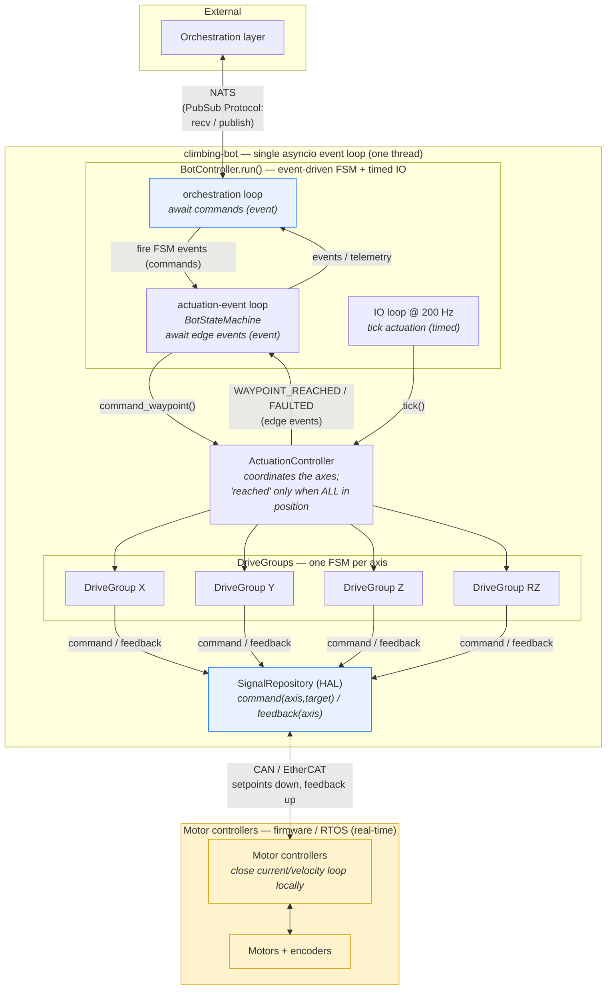
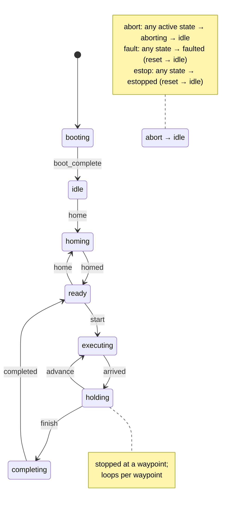
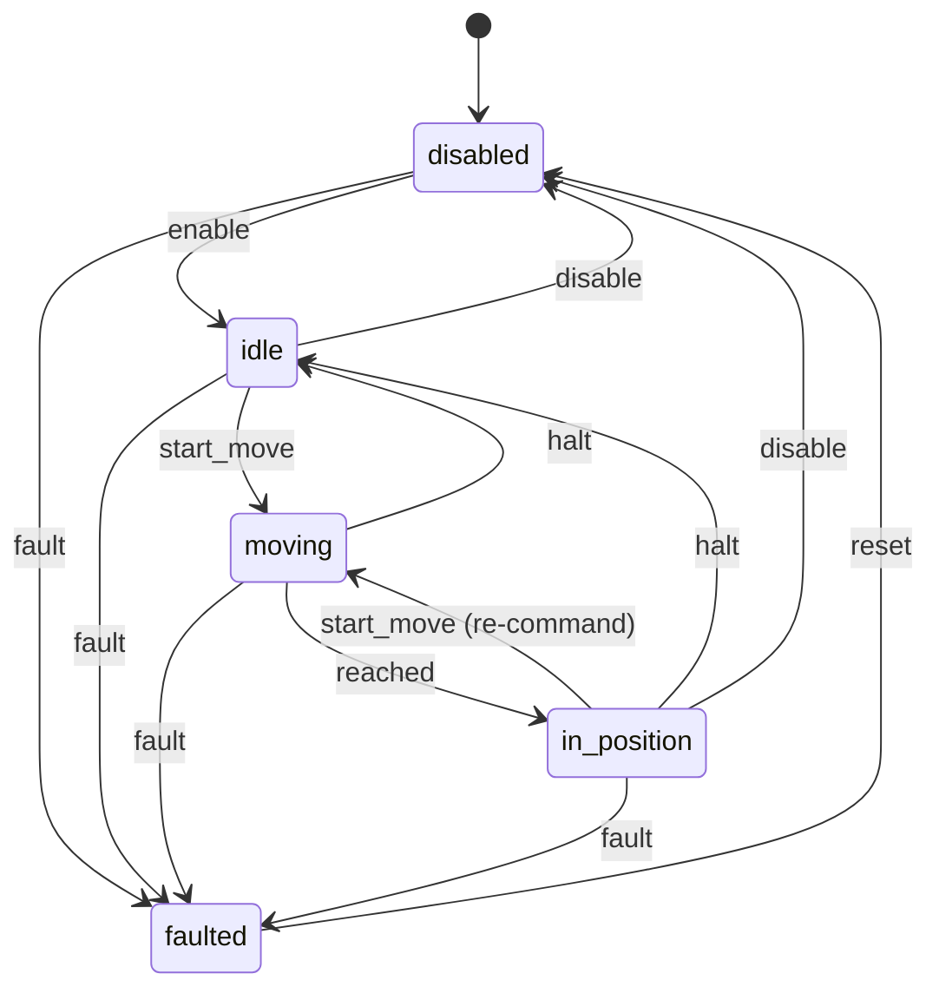

# climbing-bot architecture

This diagram reflects the code as built (`src/`), not the original whiteboard
sketch. Key differences from the sketch are called out in
[Notes](#notes-vs-the-original-sketch) at the bottom.

## System view

> The blue boxes are the **swap boundaries**: `PubSub` (in-memory ↔ NATS) and
> `SignalRepository` (mock ↔ real CAN/EtherCAT). Nothing downstream of the
> composition root (`main.py`) changes when these are swapped.
>
> The yellow region is the **real-time boundary**: loop closure runs in motor-
> controller firmware. Python streams setpoints and reads feedback — it does not
> close the servo loop.

## Bot state machine (event-driven)

## Drive group state machine (per axis)

## Notes vs. the original sketch

- **No 2D-array event queue.** The transport is a `PubSub` Protocol
  (`recv`/`publish`), swapped between `InMemoryPubSub` and NATS at the
  composition root — not a queue data structure inside the controller.
- **"Top Level Task" and "Bot State machine" are one component.**
  `BotController` owns `BotStateMachine`. The bot FSM is **event-driven**: it
  reacts to commands (orchestration loop) and to actuation edge events
  (actuation-event loop), never polling. The only timed loop is IO (200 Hz),
  which samples hardware so the drive-group FSMs can transition. All run
  cooperatively in one asyncio loop — no shared-state locking.
- **Naming reconciled.** The sketch's "Drive Group" coordinator is the code's
  `ActuationController`; the sketch's per-axis "Motor Controller" is the code's
  `DriveGroup`. This diagram uses the code's names.
- **HAL boundary made explicit.** `SignalRepository` is the CAN/EtherCAT swap
  point; the real-time servo loop lives below it in motor-controller firmware.
- **Safety paths shown.** abort / fault / estop are reachable from active
  states; a latched fault unwinds all three loops via `FaultExit`.
